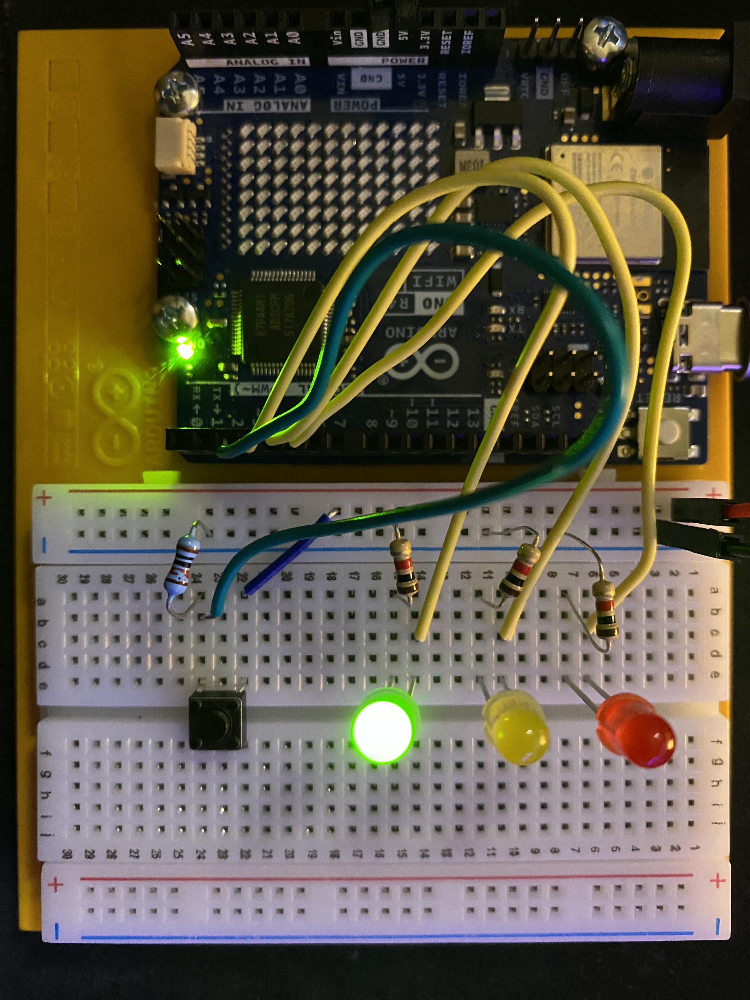

# Arduino Project 2: Spaceship Interface

A starship control panel built with an Arduino UNO R4 WiFi. A green LED shows the ship is running normally. When the button is pressed, the green LED turns off and two red LEDs flash back and forth like a warning alarm.

Based on Project 2 from the Arduino Starter Kit R4 project book.

## Demo

https://github.com/user-attachments/assets/1fb19048-ab05-4237-8d84-76545db795cb

## Parts List

- Arduino UNO R4 WiFi
- 1 green LED
- 2 red LEDs
- 3 x 220 Ω resistors (one per LED)
- 1 pushbutton
- 1 x 10 kΩ resistor (button pull-down)
- Breadboard and jumper wires

## How It Works

The sketch reads the button on a digital input pin. While the button is not pressed, the green LED stays on and the red LEDs stay off. While it is pressed, the green LED turns off and the two red LEDs alternate on and off every quarter second or so.

## Wiring

| Component | Arduino Pin |
|-----------|-------------|
| Green LED | 3 |
| Red LED 1 | 4 |
| Red LED 2 | 5 |
| Pushbutton | 2 |

## Code

The sketch is in [`spaceship_Interface_code.ino`](spaceship_Interface_code.ino).

To run it:
1. Open the `.ino` file in the Arduino IDE.
2. Select **Arduino UNO R4 WiFi** and your port under **Tools**.
3. Click **Upload**.

## What I Learned

This was my first time using an Arudino so I learned a lot about how they operate, mounting one to a board and using it with a breadboard. Furthermore this is my first real experience with software to hardware interaction which was super fun and inspiring. 

## Author

Conner Bevan
